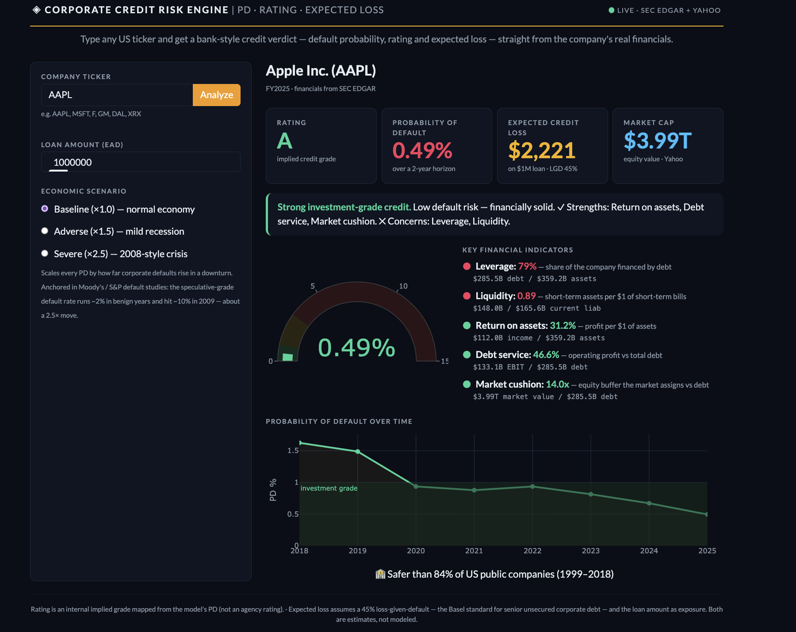
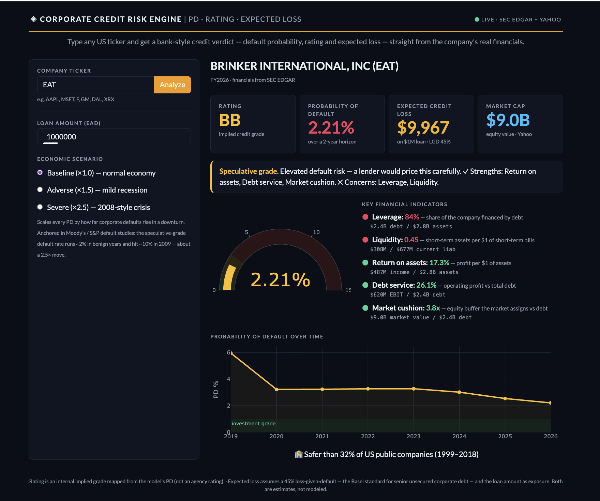
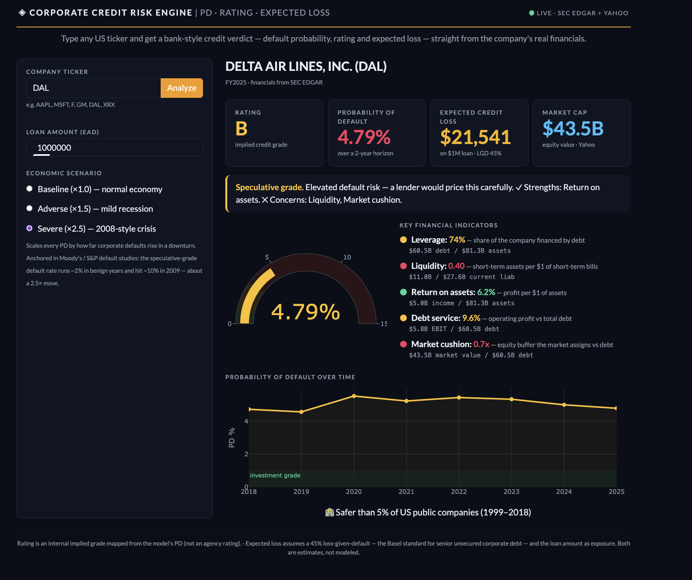

# Corporate Credit Risk Engine

**Estimating expected credit loss the way a bank does under CECL / IFRS 9.**

An interactive engine that reads a US company's fundamentals and returns its
**probability of default → credit rating → expected credit loss ($)**, with a
**macro-scenario overlay** that stresses the book for a recession — the
forward-looking piece that CECL and IFRS 9 require.

Built as the credit-risk companion to the [Fed Dual Mandate Dashboard](https://github.com/german-collado/fed-dual-mandate-dashboard): that project is the macro engine, this one is the credit model that sits on top of it.



---

## What it does

**Type a real US ticker** (AAPL, F, XRX…). The app pulls that company's latest
annual financials from **SEC EDGAR** and its live share price from **Yahoo
Finance**, runs them through the model, and returns its rating, PD and expected
credit loss — plus where it sits versus the 1999–2018 historical population.
Switching the outlook from normal to a 2008-style recession raises the PD,
downgrades the rating, and grows the expected loss.

Example: Apple scores **A** (safer than ~86% of the population); Xerox under a
severe recession scores **B** (safer than ~4%).

```bash
pip install -r requirements.txt
python app.py          # interactive dashboard at http://localhost:8050
```

*(Run `python src/model.py` first if `models/pd_model.joblib` is not present.)*

The model is **trained on 20 years of history** but **scores live companies** —
the same split between model development and deployment a bank uses.

## In action

**Brinker International (EAT)** — Chili's parent, speculative grade: profitable, but highly levered and tight on liquidity.



**Delta Air Lines (DAL)** under a **severe-recession** scenario — the dial pushes the PD up and the rating to B, and its 2020 COVID spike shows in the default-risk history.



---

## The pipeline

```
fundamentals ──► PD model ──► letter rating ──► ECL = PD × LGD × EAD ──► macro overlay
   (ratios)      (logistic)     (AAA…D)          (expected loss $)      (recession dial)
```

| Stage | What happens |
|---|---|
| **Data** | 8,971 US public companies (NYSE/NASDAQ), 1999–2018, with real Chapter 11 / 7 outcomes |
| **Features** | Leverage, liquidity, profitability & activity ratios — incl. the five Altman Z-score inputs — engineered from raw fundamentals |
| **PD model** | Interpretable logistic regression, validated **out-of-time** |
| **Rating** | PD mapped to an agency-style letter grade |
| **ECL** | `PD × LGD × EAD` → expected loss in dollars (LGD 45%, documented) |
| **Macro overlay** | Scenario multiplier (baseline / adverse / severe) shifts PDs for a downturn |

## Results

- **Discrimination:** AUC ≈ **0.80** on the 2015–2018 hold-out (out-of-time, not a random split).
- **Calibration:** when the model says 5%, ≈ 6% actually default — the PDs are believable, which is what ECL needs.
- **Stress:** on a 500-loan, $500M book, expected loss runs **~$4.8M in a normal year and ~$12M in a severe recession** (2.5×).

## Structure

```
data/raw/     raw dataset
src/features.py   verified column map, credit ratios, default label
src/model.py      train + validate the PD model
src/scoring.py    PD → rating → ECL
src/macro.py      CECL / IFRS 9 macro-scenario overlay
src/edgar.py      live financials (SEC EDGAR) + price (Yahoo) for any real ticker
app.py            interactive Dash dashboard
```

## Honest limitations

- The rating tail (CCC and below) is thin, so those bands are noisy.
- The macro multipliers are anchored in published default-rate cyclicality, not fit on the sample — the in-sample year-over-year rate is distorted by right-censoring and can't be used.
- **Market value matters a lot.** A statements-only version of the model rated Apple sub-investment-grade (levered and illiquid on paper); adding equity market value — the Merton-style equity cushion — fixed it. Live scoring therefore needs a price feed.
- Live scoring depends on companies tagging XBRL consistently; a few report line items under non-standard tags.

---

<sub>German Collado · credit & market risk analytics</sub>
